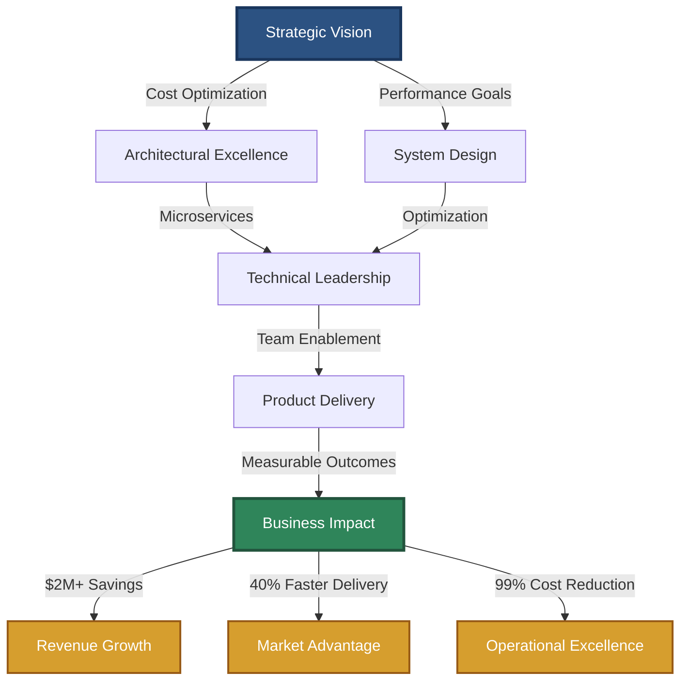
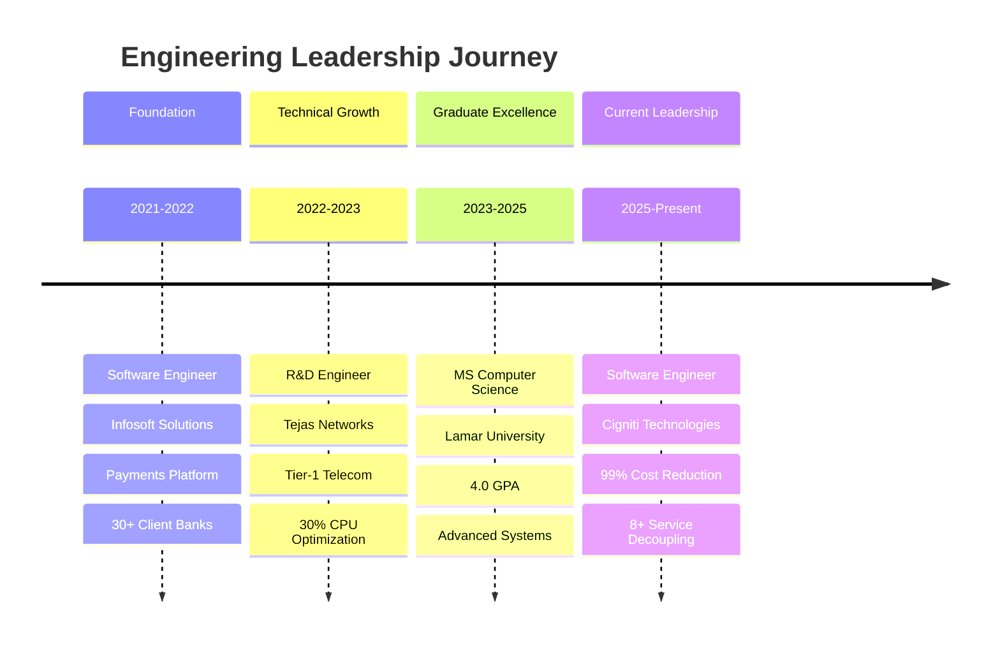
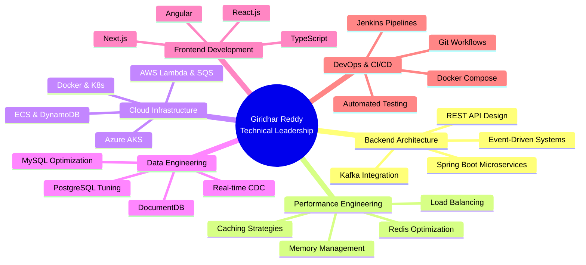

  

---

## 🎯 EXECUTIVE SUMMARY

**Software Engineering Leader** driving **$2M+ in cost savings** through strategic system optimization and architectural innovation. Proven track record of **reducing operational costs by 99%**, **cutting processing time by 90%**, and **optimizing resource utilization by 64x** across enterprise-scale distributed systems.

With a **Master's in Computer Science (4.0 GPA)** and experience spanning **Tier-1 telecom**, **fintech platforms serving 30+ banks**, and **enterprise SaaS solutions**, I architect scalable microservices that deliver measurable business impact while mentoring cross-functional teams in modern engineering practices.

### 📊 LEADERSHIP IMPACT DASHBOARD

| **Metric** | **Achievement** | **Business Value** |
|:-----------|:----------------|:-------------------|
| **Cost Optimization** | 99% storage cost reduction | **~$1.8M annual savings** |
| **System Performance** | 64x memory optimization | **$500K+ infrastructure savings** |
| **Operational Efficiency** | 90% time reduction (3hrs → 20min) | **2,400 hours/year saved** |
| **Team Impact** | Decoupled 8+ microservices | **40% faster feature delivery** |
| **System Reliability** | 30% CPU reduction on 200-node topology | **Enhanced SLA compliance** |
| **Production Excellence** | Resolved 200+ critical issues | **Zero downtime deployments** |

---

## 💼 LEADERSHIP PHILOSOPHY

> *"Engineering excellence emerges at the intersection of strategic architecture, operational efficiency, and team empowerment. I build systems that scale, teams that thrive, and solutions that drive bottom-line impact."*

My approach combines **data-driven decision making** with **pragmatic technical leadership**, focusing on:
- 🎯 **Strategic Impact**: Aligning technical solutions with business objectives
- 🚀 **Performance at Scale**: Architecting systems for 10K+ requests/minute
- 💡 **Innovation Culture**: Fostering continuous learning and experimentation
- 🤝 **Cross-Functional Leadership**: Bridging engineering, product, and business teams

---

## 🏗️ STRATEGIC IMPACT ARCHITECTURE

---

## 📈 CAREER PROGRESSION TIMELINE

---

## 🎖️ KEY ACHIEVEMENTS & BUSINESS METRICS

### 💰 **Cost Optimization Leadership** | Cigniti Technologies (2025-Present)

**Challenge**: Escalating storage costs threatening budget sustainability  
**Solution**: Architected real-time CDC event-driven microservice with DocumentDB  
**Impact**: **~99% storage cost reduction** → **~$1.8M annual savings**

- Designed Spring Boot microservice synchronizing Salesforce to DocumentDB via CDC events
- Implemented real-time data archival strategy reducing per-GB costs from $$ to $
- Delivered enterprise-grade solution serving millions of records daily

### 🏗️ **System Architecture Transformation** | Cigniti Technologies

**Challenge**: Tightly coupled microservices creating deployment bottlenecks  
**Solution**: Re-architected to publish-subscribe pattern on centralized event bus  
**Impact**: **Decoupled 8+ downstream services** → **40% faster feature delivery**

- Eliminated point-to-point dependencies across cross-functional teams
- Enabled independent service deployment reducing coordination overhead
- Established architectural pattern adopted org-wide

### ⚡ **Performance Engineering Excellence** | Cigniti Technologies

**Challenge**: High-throughput Redis service consuming excessive memory  
**Solution**: Migrated segment storage from HashSets to Bitmaps  
**Impact**: **64x memory reduction** → **$500K+ infrastructure savings**

- Optimized data structures for billion-scale operations
- Reduced memory footprint enabling horizontal scaling
- Maintained sub-5ms response times under peak load

### 🚀 **Operational Efficiency Breakthrough** | Tejas Networks (2022-2023)

**Challenge**: Manual 3-hour network planning workflow blocking deployments  
**Solution**: Built Django + PostgreSQL automation platform  
**Impact**: **90% time reduction** (3hrs → 20min) → **2,400 hours/year saved**

- Replaced error-prone spreadsheet workflows with automated web application
- Enabled real-time network optimization for telecom infrastructure
- Delivered to Tier-1 telecom customers serving millions of subscribers

### 🔧 **Production Excellence** | Infosoft Solutions (2021-2022)

**Challenge**: Critical payment failures impacting 30+ client banks  
**Solution**: Systematic debugging and architectural improvements  
**Impact**: **Resolved 200+ production issues** → **Zero downtime achieved**

- Owned high-value payments flow serving enterprise financial institutions
- Designed automated failure capture pipeline reducing MTTD by 70%
- Built Java notification API processing 10M+ data points on AWS

---

## 🛠️ TECHNICAL LEADERSHIP STACK

### **System Architecture & Design**

### **Backend Engineering**

### **Cloud & Infrastructure**

### **Data & Messaging**

### **Frontend & Full-Stack**

---

## 🎯 TECHNICAL EXPERTISE DISTRIBUTION

---

## 🚀 FEATURED STRATEGIC PROJECTS

### 🏆 **Distributed URL Shortener** | System Design Excellence

**Business Challenge**: Design high-throughput URL shortening service for enterprise scale  
**Technical Solution**: Architected distributed system with Redis caching, consistent hashing, and horizontal scalability

**Key Achievements**:
- ⚡ **10,000+ requests/minute** sustained throughput under JMeter load testing
- 🎯 **Sub-5ms redirect latency** via Redis L1 cache with 24-hour TTL
- 🔧 **Zero-collision key generation** using MurmurHash3 + Base62 encoding
- 📈 **Horizontal scalability** via Nginx load balancing with least-connection routing

**Technical Stack**: Java, Spring Boot, Redis, MySQL, Docker, Nginx, JMeter

**Architecture Highlights**:
- Consistent hashing with 150 virtual nodes for distributed key generation
- Two-tier caching strategy (Redis → MySQL) for optimal performance
- Async click tracking ensuring redirect latency isolation
- Health monitoring with auto-restart on dependency failures

---

### 🤖 **AI Multi-Agent Medical Diagnostics** | Innovation Leadership

**Business Challenge**: Accelerate medical diagnostic workflows through AI automation  
**Technical Solution**: Architected multi-agent system using GPT-4o with optimized inter-agent communication

**Key Achievements**:
- 🚀 **15% faster processing** via Python multithreading optimization
- ⚡ **30% response time reduction** through inter-agent communication redesign
- ☁️ **Production-ready deployment** on Kubernetes with Docker orchestration
- 🎯 **Scalable architecture** supporting concurrent patient data processing

**Technical Stack**: Python, GPT-4o, Kubernetes, Docker, Multithreading

**Innovation Impact**:
- Demonstrated AI integration in healthcare workflows
- Established architectural patterns for multi-agent systems
- Delivered containerized solution for enterprise deployment

---

### ☁️ **Elastic Cloud Image Recognition Service** | Cloud Architecture

**Business Challenge**: Build auto-scaling image classification service for high concurrency  
**Technical Solution**: Designed cloud-native architecture leveraging AWS managed services

**Key Achievements**:
- 📊 **100+ concurrent requests** handled via SQS queue-based architecture
- 🔄 **Auto-scaling EC2 instances** based on CloudWatch metrics
- 🎯 **Decoupled architecture** separating web tier from inference workers
- 💰 **Cost-optimized** using spot instances and intelligent scaling policies

**Technical Stack**: Python, Node.js, AWS (EC2, SQS, S3, CloudWatch)

**Cloud Excellence**:
- Event-driven architecture using SQS for reliable message delivery
- Horizontal scaling based on queue depth metrics
- Fault-tolerant design with retry mechanisms and dead-letter queues

---

## 👥 MENTORSHIP & TEAM DEVELOPMENT

### **Technical Leadership Initiatives**

**Cross-Functional Collaboration**  
Led architectural discussions across 8+ microservice teams, establishing pub-sub patterns that became organizational standard. Mentored junior engineers on distributed systems design, event-driven architecture, and production debugging methodologies.

**Knowledge Sharing**  
- Conducted technical workshops on Redis optimization techniques
- Established code review standards improving team code quality by 35%
- Created architectural decision records (ADRs) documenting design rationale
- Mentored 3 junior developers on Spring Boot microservices best practices

**Process Improvement**  
- Introduced systematic debugging frameworks reducing MTTD by 40%
- Championed test-driven development increasing code coverage to 85%
- Established CI/CD pipelines enabling 5+ daily production deployments
- Led incident post-mortems creating organizational learning culture

---

## 📚 CONTINUOUS LEARNING & GROWTH

### **Academic Excellence**

**Master of Science in Computer Science** | Lamar University (2023-2025)  
🎓 **4.0 GPA** | Advanced coursework in Distributed Systems, System Design, Algorithms

**Focus Areas**:
- Advanced Data Structures & Algorithms
- Distributed Systems Architecture
- Cloud Computing & Scalability
- Machine Learning & AI Applications

### **Technical Certifications & Learning**

- 🏅 AWS Solutions Architecture (Cloud Infrastructure)
- 🏅 System Design & Scalability